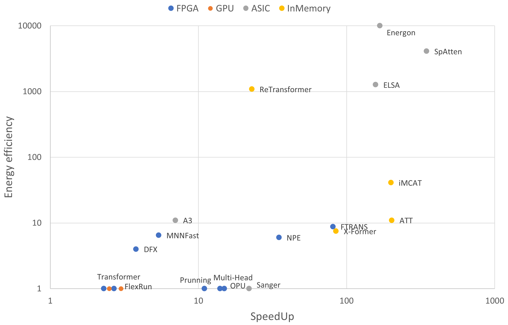

# A Syrvey on Hardware Accelerators for Large Language Models

You can read the relevant paper here: [A Survey on Hardware Accelerators for Large Language Models](https://arxiv.org/abs/2401.09890)

Feel free to cite the paper:
```
@misc{kachris2024survey,
      title={A Survey on Hardware Accelerators for Large Language Models}, 
      author={Christoforos Kachris},
      year={2024},
      eprint={2401.09890},
      archivePrefix={arXiv},
      primaryClass={cs.AR}
}
```
An overview of the speedup and Energy efficiency of Hardware accelerators for LLMs
(If there is no energy efficiency measurements the paper is plotted in the x-axis as if the energy efficiency was 1) 



The following table shows the research papers focused on the acceleration of LLMs (mostly transformers) categorized on the computing platform (FPGA, GPU, ASIC, In-memory).

If you are interested to add you research paper in the list contact me here: [Christoforos Kachris](https://users.uniwa.gr/kachris/)


| Year | Type | Title   | Speedup | Energy efficiency |
| ---- | ---- | ------- | ------- | ----------------- |
| 2019 | FPGA | [MnnFast: A Fast and Scalable System Architecture for Memory-Augmented Neural Networks](https://ieeexplore.ieee.org/document/8980322) | 5.4x | 4.5x |
| 2020 | FPGA | [FTRANS:  Energy-Efficient Acceleration of Transformers Using FPGA](https://arxiv.org/pdf/2007.08563) | 27-81x | 8.8x |
| 2020 | FPGA | [Hardware Accelerator for Multi-Head Attention and Position-Wise Feed-Forward in the Transformer](https://arxiv.org/abs/2009.08605)   | 14x | |
| 2021 | FPGA | [An FPGA-Based Overlay Processor for Natural Language Processing](https://arxiv.org/abs/2104.06535)   | 35x | 4x-6x |
| 2021 | FPGA | [Accelerating Transformer-based Deep Learning Models on FPGAs using Column Balanced Block Pruning](https://ieeexplore.ieee.org/document/9424344)   | 11-2x | |
| 2022 | FPGA | [DFX: A Low-latency Multi-FPGA Appliance for Accelerating Transformer-based Text Generation](https://arxiv.org/abs/2209.10797) | 3.8x | 4x |
| 2022 | FPGA | [Hardware Acceleration of Transformer Networks using FPGAs](https://ieeexplore.ieee.org/document/9976354)   | 2.3x | |
| 2023 | FPGA | [Transformer-OPU: An FPGA-based Overlay Processor for Transformer Networks](https://ieeexplore.ieee.org/document/10171578/)  | 15x | |
| 2023 | FPGA | [A Fast and Flexible FPGA-Based Accelerator for Natural Language Processing Neural Networks](https://dl.acm.org/doi/10.1145/3564606)   | 2.7x | |
| 2023 | FPGA | [A Cost-Efficient FPGA Implementation of Tiny Transformer Model using Neural ODE](https://arxiv.org/abs/2401.02721)   | 12.8x | 9.2x |
| 2022 | GPU A100 | [Accelerating Transformer Networks through Recomposing Softmax Layers](https://ieeexplore.ieee.org/document/9975410)  | 2.5x   | | 
| 2022 | GPU A100 | [LightSeq2: Accelerated Training for Transformer-Based Models on GPUs](https://arxiv.org/abs/2110.05722)  | 3x   | | 
| 2023 | GPU V100 | [Inference with Reference: Lossless Acceleration of Large Language Models](https://arxiv.org/abs/2304.04487)  | 2x   | | 
| 2022 | CPU | [Exponentially Faster Language Modelling](https://arxiv.org/abs/2311.10770)   | 78x  | | 
| 2020 | ASIC 40nm | [A3: Accelerating Attention Mechanisms in Neural Networks with Approximation](https://taejunham.github.io/data/a3_hpca2020.pdf)  | 7x   | 11x | 
| 2021 | ASIC 40nm | [ELSA: Hardware-Software Co-design for Efficient, Lightweight Self-Attention Mechanism in Neural Networks](https://taejunham.github.io/data/elsa_isca21.pdf)  | 157x   | 1265x | 
| 2021 | ASIC 40nm | [SpAtten: Efficient Sparse Attention Architecture with Cascade Token and Head Pruning](https://hanlab.mit.edu/projects/spatten)  | 347x/162x   | 4059x/1093x | 
| 2021 | ASIC 55nm | [Sanger: A Co-Design Framework for Enabling Sparse Attention Using Reconfigurable Architecture](https://dl.acm.org/doi/abs/10.1145/3466752.3480125)  | 22.7x/4.64x   | | 
| 2023 | ASIC 45nm | [Energon: Toward Efficient Acceleration of Transformers Using Dynamic Sparse Attention](https://arxiv.org/abs/2110.09310)  | 168x/8.7x   | 10000x/1000x | 
| 2020 | In-memory | [ATT: A Fault-Tolerant ReRAM Accelerator for Attention-based Neural Networks](https://www.computer.org/csdl/proceedings-article/iccd/2020/971000a213/1pK5cZB2u1G)  |  202x  | 11x | 
| 2020 | In-memory | [ReTransformer: ReRAM-based Processing-in-Memory Architecture for Transformer Acceleration](https://par.nsf.gov/servlets/purl/10225128)  |  23x  | 1086x | 
| 2022 | In-memory | [In-Memory Computing based Accelerator for Transformer Networks for Long Sequences](https://ieeexplore.ieee.org/document/9474146)  |  200x  | 41x | 
| 2023 | In-memory | [X-Former: In-Memory Acceleration of Transformers](https://arxiv.org/abs/2303.07470)  |  85x  |  7.5x | 
| 2023 | Flash | [LLM in a flash: Efficient Large Language Model Inference with Limited Memory](https://arxiv.org/abs/2312.11514)  | 25x/5x   | | 
